# Web Attacks - Skills Assessment

## Scenario

You are performing a web application penetration test for a software development company, and they task you with testing the latest build of their social networking web application. Try to utilize the various techniques you learned in this module to identify and exploit multiple vulnerabilities found in the web application.

The login details are provided in the question below.

## Tools Used For This Assessment

- Web Browser
- Burp Suite
- FFUF

## Question

Try to escalate your privileges and exploit different vulnerabilities to read the flag at '/flag.php'

Authenticate to 154.57.164.81:30213 , with user "htb-student" and password "Academy_student!" 

## Solution

### Step 1 

Authenticate to `http://154.57.164.81:30213/` with initial user "htb-student" and password "Academy_student!" 


### Step 2 

After logged in, check Burp HTTP History and analyze them, we found an API call `GET /api.php/user/74`, it reference an identifier and has IDOR potential.


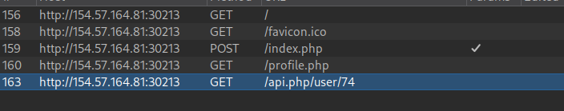

After looking at the response, there's a JSON data that retrieve uid, username, and other potential useful information
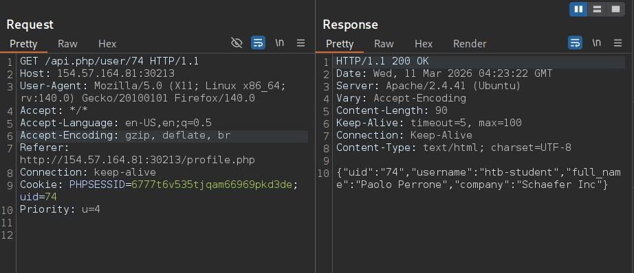

send the request to Repeater for further testing 


### Step 3 

Inside Repeater, try changing the uid inside the request line from `GET /api.php/user/74` to `GET /api.php/user/75`, and analyze the difference. 
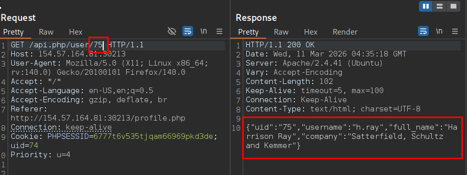

As we can see, we're able to retrieve other user's information directly by referencing the identifier, this confirms our IDOR suspicion.


### Step 4 

Enumerate the amount of users available by keep adding the number until there's an empty response, we found out that there are 100 users available, this is useful because we'll use this information to create a wordlist to FUZZ to see if there's any administrator user.


### Step 5 

Create a 1 to 100 wordlist
```bash
seq 100 > 1to100.txt
```

the command above create sequential number from 1 to 100 and saved it to `1to100.txt` file


### Step 6 

Start fuzzing by looking for any users that has "admin" string in them
```bash
ffuf -w 1to100.txt -u http://154.57.164.69:31760/api.php/user/FUZZ -mr "(?i)admin"
```
Command Explanation : 
- `-w` : wordlist
- `-u` : URL, fuzzing the uid 
- `-mr "(?i)admin"` : Search for string "admin" in the response body, (?i) means it's case insensitive

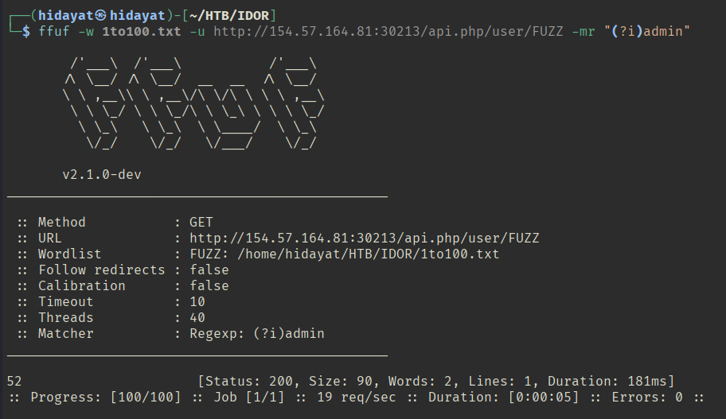

we got a hit! 


### Step 7

Back to Repeater, change the uid to 52 in `GET /api.php/user/52` and we got the following information:
```json
{"uid":"52","username":"a.corrales","full_name":"Amor Corrales","company":"Administrator"}
```

note it down since it has the potential to be the admin account to escalate our privilege.


### Step 8

Let's test other feature such as `http://154.57.164.81:30213/settings.php`, after visiting, it's a page where user can change their password, insert our new password and analyze the Burp's HTTP History
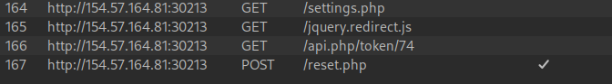

upon clicking the submit button, the website made two requests, The first is `GET /api.php/token/74` which retrieve user's token (we'll know the purpose of this token after we analyze next request) Send this request to Repeater for further investigation. 
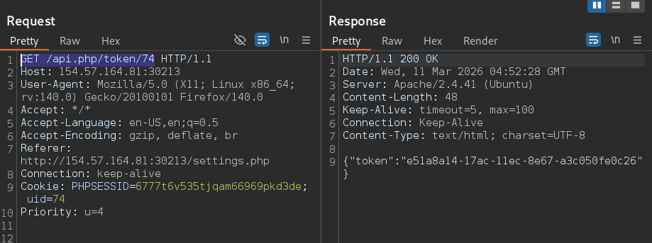

The second endpoint we found is `POST /reset.php` which request the password change to the server, it uses the earlier token as CSRF token. If successful it sends a response with a string that says "Password changed successfully". Send this request to Repeater for further investigation.
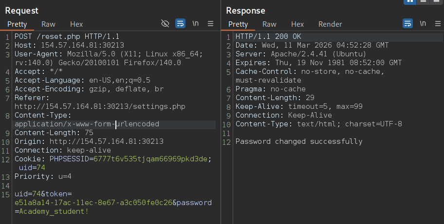


### Step 9

Test for IDOR vulnerability in `GET /api.php/token/{uid}` endpoint, try for our target admin user by changing the uid to 52
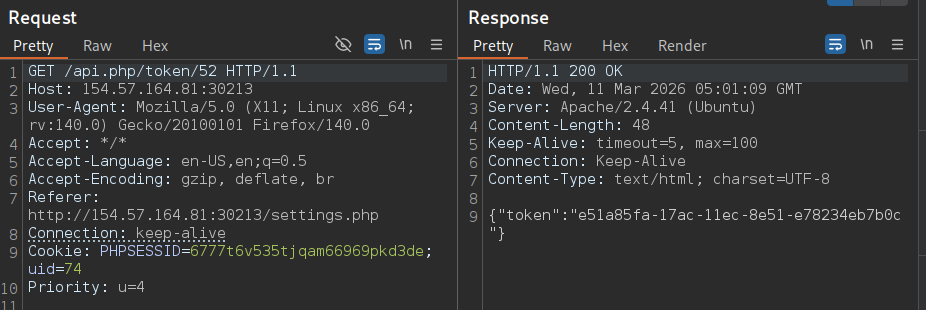

as you can see, it's vulnerable and retrieve the CSRF token
```json
{"token":"e51a85fa-17ac-11ec-8e51-e78234eb7b0c"}
```

### Step 10

Now test `POST /reset.php` endpoint by changing its password using the token
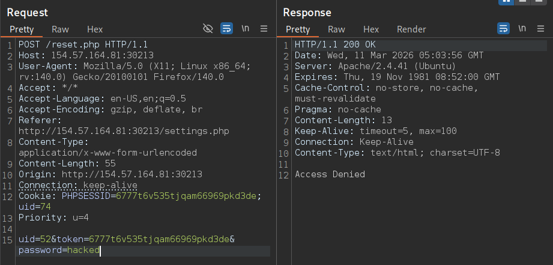

It response with an error message that says "Access Denied", let's try if this endpoint has HTTP Verb Tampering vulnerability by changing the Request method by using right click + "Change request method", send the request and see the response and it worked!
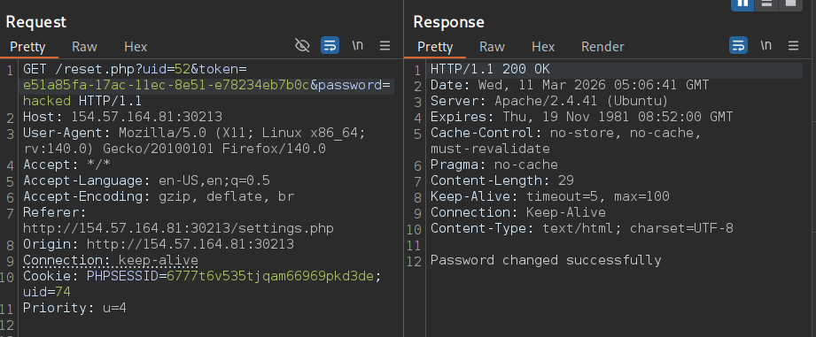


### Step 11

Logged in as the admin using the following credential `a.corrales:hacked`, analyze the the page and notice that we got a new admin only privilage feature in `/event.php` endpoint.


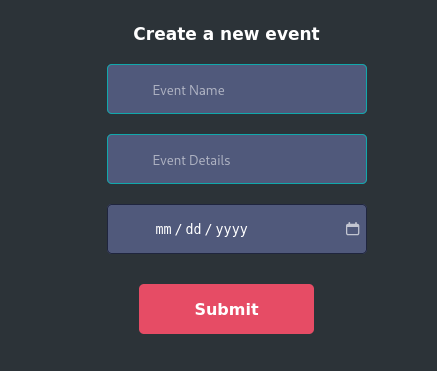


### Step 12

Fill the form and analyze the HTTP History, it requested to `POST /addEvent.php` endpoint that send the form in XML format and reflected in the name element, this has the potential to have XXE Injection vulnerability, send the request to Repeater for further investigation.
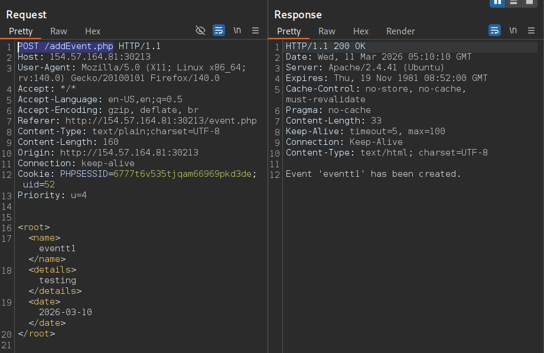


### Step 13

Open `/event.php` endpoint on Repeater, since our goal is to read the content of '/flag.php', use the Local File Exposure technique that encode the php code into base64 to avoid breaking the page. the request body should look like this.
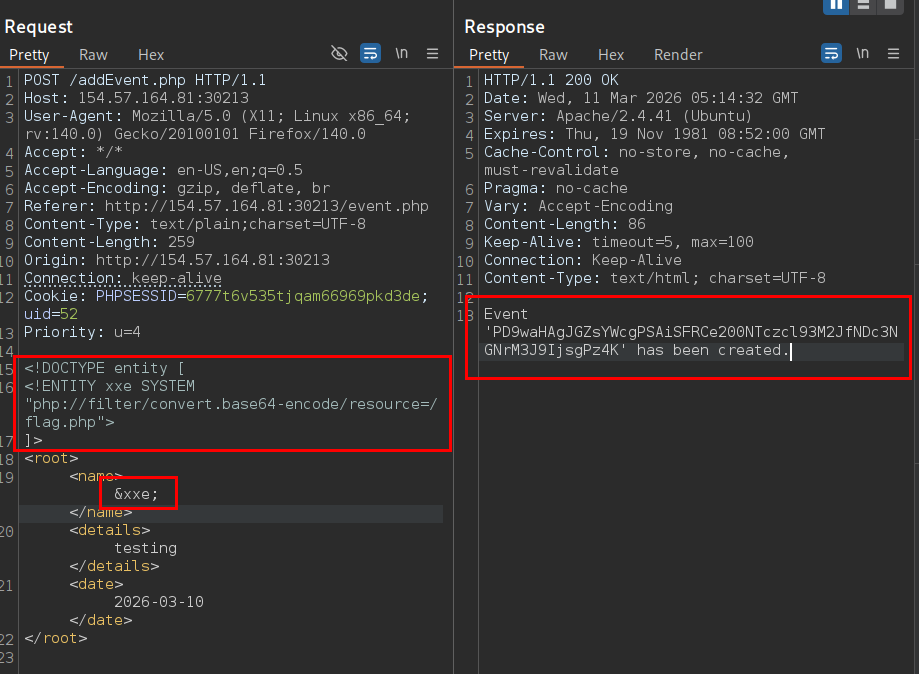

### Step 14

Decode the Base64 text to retrieve the PHP code which contains the flag
```bash
echo "PD9waHAgJGZsYWcgPSAiSFRCe200NTczcl93M2JfNDc3NGNrM3J9IjsgPz4K" | base64 -d
```
